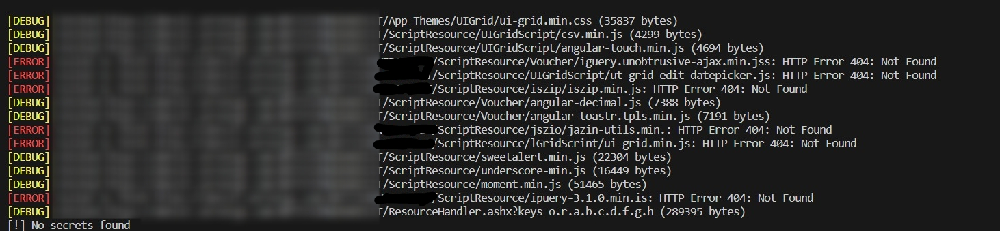

# 🔍 LeakHunt v2.0.0
LeakHunt is now an **independent secret scanner** for bug bounty and security testing workflows.
It scans URLs and local files, supports multithreaded fetching, entropy filtering, severity tagging, and JSON reporting.

## Features

- Independent scanner engine (no SecretFinder / LinkFinder dependency)
- Extended secret detection patterns, including:
  - GitHub tokens (`ghp_`, `github_pat_`)
  - Discord tokens
  - Firebase keys
  - OAuth Bearer tokens
  - Private key blocks
  - Mailgun / SendGrid / Twilio keys
- Entropy scoring to reduce weak false positives
- Deduplicated findings
- Multi-threaded target fetching (`-t`)
- CLI inputs: single URL, URL/file lists, local files, mixed targets
- JSON export (`-o`)
- Verbose debug logging (`-v`)
- Severity summary (high / medium / low)

## Installation

```bash
pip install -r requirements.txt
pip install .
```

## CLI Usage

```bash
# mixed targets
leakhunt -t 8 -o findings.json https://example.com/app.js ./local.js

# single URL (repeatable)
leakhunt -u https://example.com/app.js -u https://example.com/main.js

# targets from file (URLs and/or local paths)
leakhunt -U lab/targets.txt -t 10 -v

# local files
leakhunt -f lab/index.html -f lab/test_private_key.txt
```
---     

## Local Testing Lab

1. Start a local server from repo root:

2. In another terminal:

```bash
leakhunt -U lab/targets.txt -t 5 -v -o lab/results.json
```

Lab assets include:
- `lab/index.html` with dummy tokens
- `lab/test_private_key.txt` with a dummy private key block


## Ethics Warning
> Use LeakHunt only on systems you own or have explicit authorization to test. Unauthorized scanning may violate laws, terms of service, or responsible disclosure rules.

---
## Release Notes (v2.0.0)

- Full project refactor into package layout (`leakhunt/`)
- Independent scanning engine with expanded pattern bank
- Multi-threaded fetching and flexible CLI target input
- JSON report output and severity summaries
- Local lab files for repeatable testing
- Packaging support via `setup.py`
